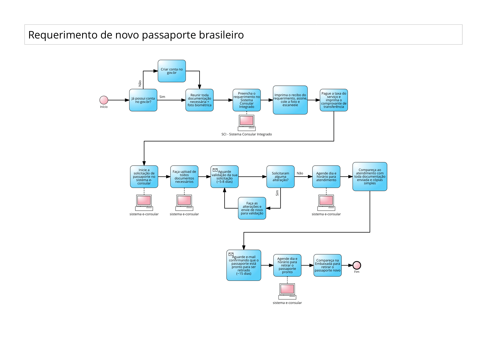
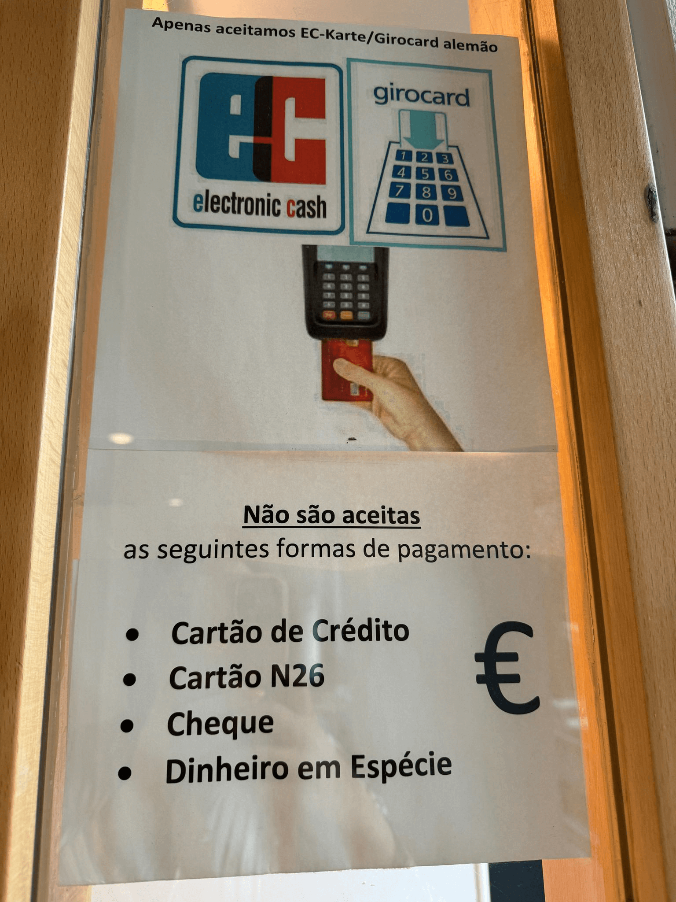
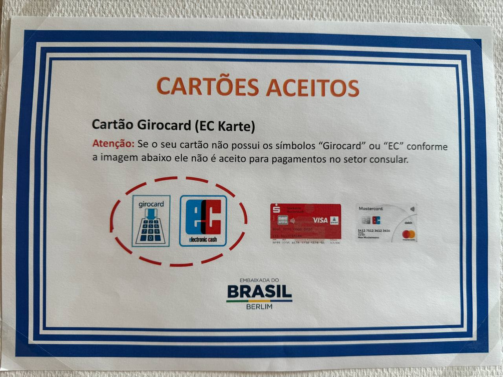
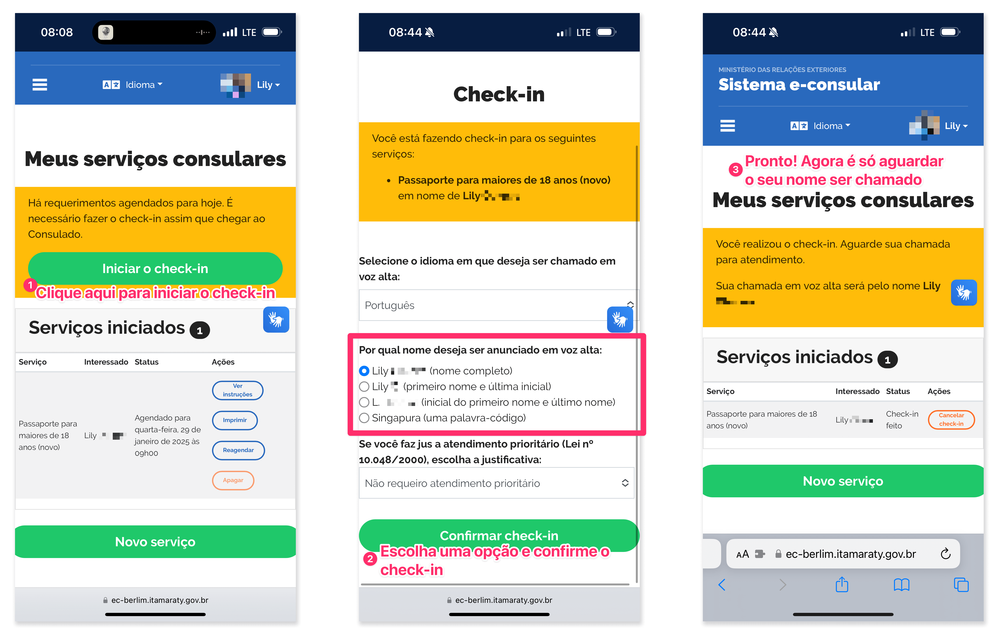

# Renovar passaporte Brasileiro morando na Alemanha
Quando chegar o momento de renovar o seu passaporte, se você mora na Alemanha, você deve solicitar um novo passaporte diretamente na Embaixada do Brasil.

Você pode ver estas instruções diretamente no site da Embaixada de Berlim [clicando aqui](https://ec-berlim.itamaraty.gov.br/instructions?id=66290b2290b03c0014d628c3) (é necessário fazer login com o gov.br para visualizar esta página).

**Atenção:** Este guia assume que você deseja ter atendimento na Embaixada do Brasil em Berlim. Caso você queira ter atendimento em outra cidade, certifique-se de realizar o requerimento no site específico da embaixada onde você pretende ser atendida. (por exemplo: Embaixada do Brasil em Frankfurt).

Você pode encontrar a página do consulado brasileiro em outras cidades e países no [site principal do Serviço Consular Brasileiro: https://econsular.itamaraty.gov.br/](https://econsular.itamaraty.gov.br/) 

## O que preciso para solicitar um novo passaporte brasileiro morando na Alemanha?
  - acesso ao sistema [gov.br](https://www.gov.br/pt-br/) - caso ainda não tenha acesso, crie uma conta. Os dados de acesso ao sistema gov.br serão utilizados para fazer login no site da embaixada (seu CPF + senha cadastra no gov.br). Você pode criar uma conta também pelo app do gov.br para [Android](https://play.google.com/store/apps/details?id=br.gov.meugovbr&hl=pt) ou [iOS](https://apps.apple.com/pt/app/gov-br/id1506827551) e realizar reconhecimento facial pelo app para ter acesso a mais serviços.
  - documentos de identificação a serem utilizados na solicitação de um novo passaporte (RG ou CNH ou Passaporte Atual, Certidão de Nascimento brasileira ou Certidão de Casamento), bem como o passaporte atual, ainda que vencido.
  - cópias simples dos documentos utilizados durante o requerimento.
  - fotografia em modelo biométrico1 (3.5cm x 4.5cm **OU** 3cm x 4cm) - tenha em mãos a versão digital desta fotografia, pois você também vai precisar fazer upload desta foto em um dos passos.
  - certidão de quitação eleitoral. Esta certidão pode ser obtida diretamente no site do [Tribunal Superior Eleitoral através deste link](http://www.tse.jus.br/eleitor/certidoes/certidao-de-quitacao-eleitoral).
  - original do documento militar - apenas para requerentes do sexo masculino entre 18 e 45 anos.
    - **NOTA:** mulheres trans que já fizeram a retificação de nome e gênero não precisam apresentar este documento ou incluí-lo durante o preenchimento do formulário. Homens trans entre 18 e 45 anos devem apresentar este documento no dia do atendimento consular e incluí-lo durante o preenchimento dos formulários.
  - comprovante impresso do pagamento da taxa para emissão de novo passaporte.

1. Caso precise de tirar fotos novas para o passaporte, várias lojas oferecem este serviço. Eu tirei minha última foto biométrica em uma loja da franquia [Studioline](https://www.studioline.de/fotoshootings-und-preise/passfotos) - procure por "Studioline" no Google Maps para encontrar a loja mais próxima de você, achei o serviço bom e preço ok (por volta de 25€ com 5 fotos impressas), e também recebi as fotos via e-mail. O tamanho `3.5cm x 4.5cm` é o tamanho padrão em documentos alemães, e foi o tamanho que escolhi também para o passaporte brasileiro, [como indicado nas instruções da Embaixada de Berlim](https://www.gov.br/mre/pt-br/embaixada-berlim/consular/passaporte-para-maiores). **NOTA:** se você disser à pessoa que está imprimindo as suas fotos que você vai usar as fotos para documentos brasileiros, pode ser que eles selecionem a configuração padrão para o Brasil no software de edição deles, que normalmente vai ajustar o tamanho para `3cm x 4cm` - caso queira fotos em tamanho `3.5cm x 4.5cm` como eu fiz, apenas diga à pessoa para imprimir as fotos em tamanho biométrico padrão. Caso você more em Hamburgo, também recomendo o [Estúdio Inga Sommer](https://ingasommer.de/preise/) - já fiz fotos biométricas com eles enquanto morava em Hamburgo e gostei muito do atendimento 😃.

## Qual é o processo para requerer o novo passaporte?
Visualização do processo de requerimento de um novo passaporte:

Os passos para requerer um novo passaporte são:
  - preencha o requerimento de novo passaporte no Sistema Consular Integrado neste link: https://formulario-mre.serpro.gov.br/sci/pages/web/ui/#/servicos-brasileiros   Caso tenha dúvidas sobre como preencher qualquer campo [clique aqui para ver instruções detalhadas, providenciadas pela própria embaixada](https://www.gov.br/mre/pt-br/embaixada-berlim/consular/anexos/consularpassos.pdf).

  - ao finalizar o preenchimento do requerimento, imprima o Recibo de Entrega de Requerimento (RER), assine, cole sua foto no campo indicado, e **escaneie o requerimento assinado e com foto**, pois você irá fazer upload deste documento assinado e com foto nos próximos passos.

  - pague a taxa para obter novo passaporte. No momento da escrita deste guia o valor da taxa era de `€132.00 (cento e trinta e dois Euros)`. Você pode verificar [neste link](https://www.gov.br/mre/pt-br/embaixada-berlim/consular/paginas/custos) os valores atuais para cada serviço consular e a conta bancária da Embaixada de Berlim para realizar a transferência.

  - Imprima o comprovante de transferência bancária, será necessário fazer upload no próximo passo e também levar o comprovante impresso no dia do seu atendimento.

  **NOTA:** o solicitante pode optar por pagar a taxa no dia do atendimento consular, porém, eu recomendo fazê-lo por transferência bancária, pois na embaixada são aceitos **apenas cartões EC-Karte / Girocard alemães**, não são aceitos cartões de crédito, cartões de bancos como N26/Revolut/etc, ou dinheiro em espécie.

  

    
Veja como é indicado na própria Embaixada (clique para expandir)

    
    
  

  - Todos estes passos até então foram no Sistema Consular Integrado. Com isto feito, inicie o processo de solicitação de um novo passaporte no sistema e-consular da embaixada de Berlim. Vá [neste link com todas as intruções](https://ec-berlim.itamaraty.gov.br/instructions?id=66290b2290b03c0014d628c3) e clique em "Iniciar serviço" no fim da página.

  - Preencha cada etapa e faça upload de toda documentação necessária. No momento de escrita deste guia, o total era de 12 etapas:

1. CPF
2. Dados pessoais - nome completo, data de nascimento, e-mail, estado civil.
3. Recibo de entrega do formulário eletrônico - o recibo de entrega de requerimento assinado e com foto dos passos anteriores.
4. Foto do requerente - deve ser a mesma foto que você colou no recibo de entrega de requerimento.
5. Passaporte atual.
6. Comprovante de nacionalidade - Certidão de Nascimento brasileira ou Certidãode Casamento brasileira.
7. Documento de identificação - RG ou CNH ou Passaporte atual, ainda que vencido
8. (somente em caso de mudança de nome ou sobrenome) Fotografia da certidão que comprove a mudança de nome. Exemplo: certidões de casamento. No caso de pessoas trans, aqui você deve fazer upload de sua Certidão de Nascimento de Inteiro Teor.
9. Comprovante de quitação eleitoral - obtida diretamente no site do [Tribunal Superior Eleitoral através deste link](http://www.tse.jus.br/eleitor/certidoescertidao-de-quitacao-eleitoral).
10. Documento militar (se aplicável) - **NOTA:** mulheres trans que já fizeram a retificação de nome e gênero não precisam fazer upload deste documento. Homens trans entre 18 e 45 anos devem incluir este documento.
11. Comprovante de pagamento da taxa consular (no caso de transferência bancária).
12. Termos de uso - você deve marcar que leu e aceita os termos de uso.

  - Ao finalizar o preenchimento e envio de toda documentação necessária, você deve **aguardar a validação dos dados enviados** pela embaixada. Eles irão enviar um e-mail dizendo que sua documentação foi validada ou solicitando alteraçoes. **APENAS APÓS RECEBER ESTE E-MAIL DE CONFIRMAÇÃO** você poderá agendar seu atendimento no consulado (ou enviar a documentação via correios, caso opte por esta opção2). O prazo para validarem a sua documentação e te mandarem um e-mail é em torno de 5-10 dias.
  
  Para agendar o atendimento, faça login novamente no sistema [e-consular do site da Embaixada de Berlim](https://ec-berlim.itamaraty.gov.br/) (**NOTA: não é no site ou app gov.br!** - porém você vai fazer login com os mesmos dados de login cadastrados no gov.br!), clique no seu nome, então clique em "Meus serviços", você irá ver a sua solicitação atual e uma opção para continuar e marcar uma data para seu atendidimento. Escolha uma data e horário, e prepare-se para comparecer na Embaixada na data e horário marcados com os documentos enviados digitalmente em mãos. O endereço da Embaixada em Berlim é: **`Wallstraße 57, 10179 Berlin`**. ([clique aqui para ver no Google Maps](https://maps.app.goo.gl/uLbYbvtXKyQp63uh6)).

  - **MUITO IMPORTANTE:** No dia do seu atendimento consular, ao chegar no consulado, você deve fazer `check-in` no seu atendimento. Para isto, você deve acessar com seu celular o sistema [e-consular do site da Embaixada de Berlim](https://ec-berlim.itamaraty.gov.br/) com o link https://ec-berlim.itamaraty.gov.br (de novo: **não é no site ou app gov.br**, mas sim no site específico da Embaixada onde você será atendida!). Na embaixada tem papeis afixados com a rede Wi-fi e senha para que você possa conectar com o seu celular e fazer o check-in.

  Ao fazer login no sistema e-consular, clique em seu nome e então em "Meus serviços", você verá um novo botão "Iniciar o check-in", clique neste botão, escolha o idioma e como deseja ser chamada, e então aguarde que vão te chamar pelo nome. Veja as imagens abaixo caso algo não tenha ficado claro.

  **Processo de check-in no dia do atendimento**
  

Após ter o atendimento na embaixada, você deve aguardar um novo e-mail informando que o seu passaporte está pronto3. Quando você receber o novo e-mail dizendo que o seu passaporte está pronto, você deve novamente fazer login no sistema [e-consular do site da Embaixada de Berlim](https://ec-berlim.itamaraty.gov.br/), solicitar o serviço "Buscar documento já pronto" e novamente agendar um dia para ir na Embaixada buscar o seu novo passaporte. 🎉 No dia marcado para buscar o seu novo passaporte, lembre-se de **fazer check-in para o atendimento ao chegar no consulado conforme passos indicados acima**.

2. Caso você opte por enviar sua documentação pelos correios, é necessário entregar envelope extra com o endereço completo do requerente para que o Consulado possa reenviar o passaporte novo pelos correios. O envelope deve ter, no mínimo, o tamanho de meia página A4 (B5 ou C5), forrado (destes com plástico bolha na parte de dentro), selado com 4,15€ "Einschreiben/Einwurf", para envio como carta registrada.

3. Caso tenha optado por receber o passaporte via correios, você irá receber o pasaporte no endereço informado no envelope entregue à Embaixada para envio.

## FIM 💖
Parabéns! Você fez todos os passos para obter um novo passaporte brasileiro. Se você gostou deste guia, [considere _me pagar um cafézin_ ☕😊](https://ko-fi.com/lily_neinhorn)

## Links
Aqui estão todos os links utilizados neste guia:
  - Site oficial GOV.BR: https://www.gov.br/pt-br/
  - App gov.br na Play Store (para Android): https://play.google.com/store/apps/details?id=br.gov.meugovbr&hl=pt
  - App gov.br na App Store (para iOS): https://apps.apple.com/pt/app/gov-br/id1506827551
  - Link para retirar certidão de quitação eleitoral: http://www.tse.jus.br/eleitor/certidoes/certidao-de-quitacao-eleitoral
  - Custos dos diversos serviços consulares na Embaixada do Brasil em Berlim: https://www.gov.br/mre/pt-br/embaixada-berlim/consular/paginas/custos
  - Formulário de requerimento de passaporte no Sistema Consular Integrado: https://formulario-mre.serpro.gov.br/sci/pages/web/pacomPasesWebInicial.jsf
  - Guia de preenchimento do primeiro formulário de requerimento de novo passaporte: https://www.gov.br/mre/pt-br/embaixada-berlim/consular/anexos/consularpassos.pdf
  - Instruções para obtenção de novo passaporte no site gov.br: https://www.gov.br/mre/pt-br/embaixada-berlim/consular/passaporte-para-maiores
  - Instruções para obtenção de novo passaporte no site da Embaixada de Berlim: https://ec-berlim.itamaraty.gov.br/instructions?id=66290b2290b03c0014d628c3
  - Sistema e-consular da Embaixada do Brasil em Berlim: https://ec-berlim.itamaraty.gov.br/
  - Site da franquia Studioline para tirar fotos para o passaporte: https://www.studioline.de/fotoshootings-und-preise/passfotos
  - Estúdio Inga Sommer (em Hamburgo): https://ingasommer.de/preise
  - Embaixada do Brasil em Berlim no Google Maps: https://maps.app.goo.gl/uLbYbvtXKyQp63uh6
  - Site principal do Serviço Consular Brasileiro: https://econsular.itamaraty.gov.br/

🩵🩷🤍🩷🩵
